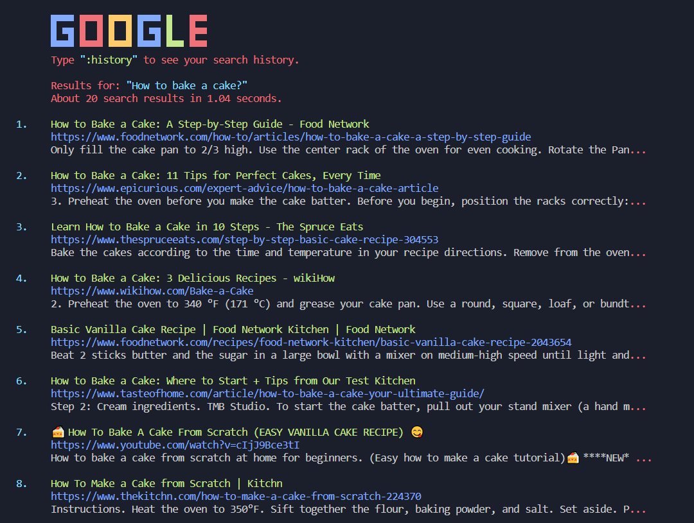

# google-search-console
Get google search results, directly on your terminal screen

    git clone https://github.com/QuantumByteStudios/google-search-on-console
   
 

Runtime Screenshot   

  

 

Solution if you find this error:

  

If you find this error kindly create a file `apiKey.py` in `src` folder and create python function & paste your `api key` as shown below:

  

